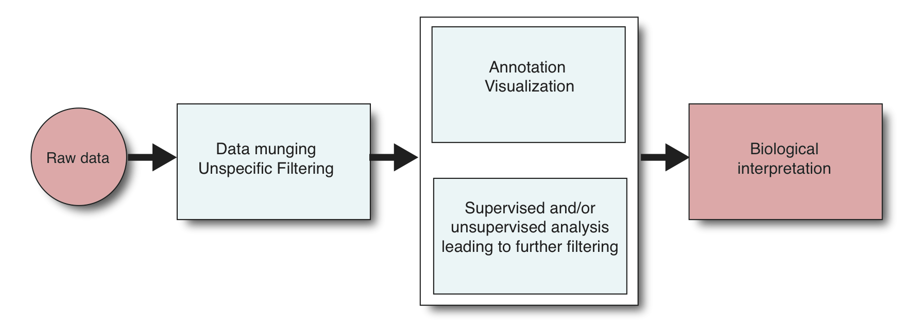

# Computational Genomics and R
The aim of computational genomics is to do biological interpretation of high dimensional genomics data. Generally speaking, it is similar to any other kind of data analysis but often times doing computa- tional genomics will require domain specific knowledge and tools. The tasks of computational genomics can be roughly summarized below.

Most of the time, the analysis starts with the raw data (if you
are somehow served with already processed data, consider yourself lucky). The raw data could be image files from a microarray, or text files from a sequencer. That means the analysis starts with processing the data to a manageable format. This processing includes data munging which is transforming the data from one format to another, data point transformations such as normalizing and log transformations, and filtering and removing data points with specific thresholds. For example. you may want to remove data points that have unreliable measurements or missing values. The next step is
to apply supervised/unsupervised learning algorithms to test the hypothesis that lead to experiments that generated the data. This step also includes quality checks about your data.

Another important thing to do is to annotate and visualize your data. For example, after finding transcription factor binding sites using data from ChIP-seq experiments, you would like to see what kind of genes they are nearby or what kind of other genomic features they overlap with. Do they overlap with promoters or they are distal? You may also like to see your binding sites on the genome or make a summary plot showing distances to nearest transcriptions start sites. All of this tasks
can be classified as visualization and annotation tasks.

All of these steps should hopefully lead you to the holy grail which is biological interpretation of the data and hopefully to some new insights about genome biology.
