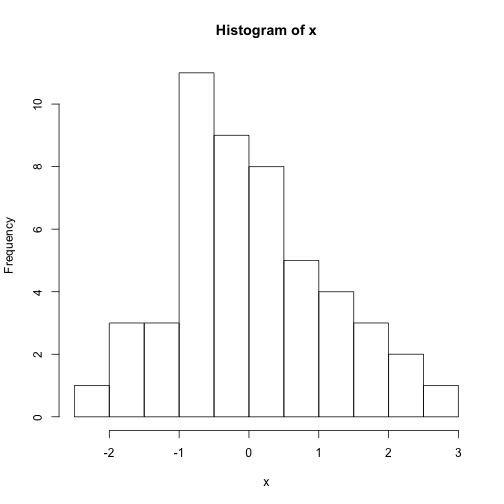
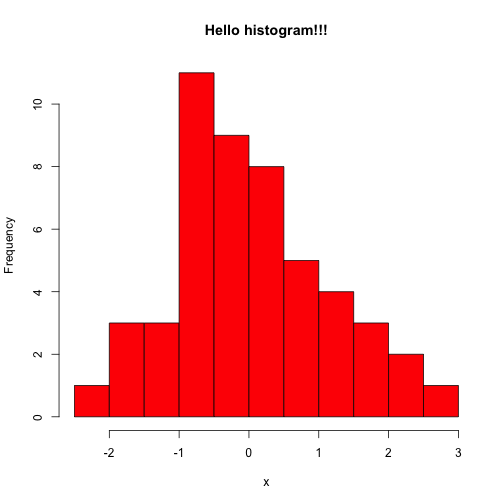
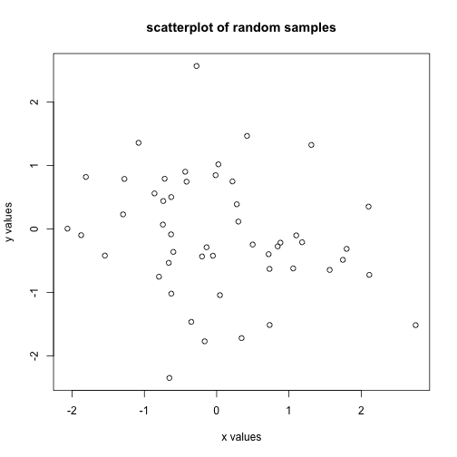
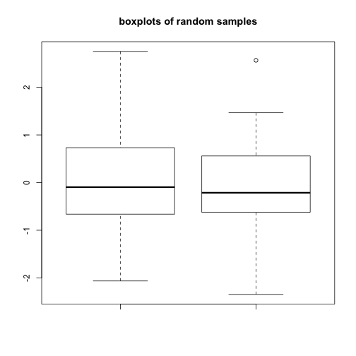
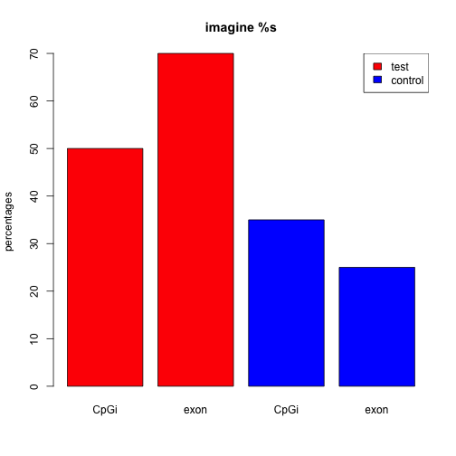

# Plotting in R
R has great support for plotting and customizing plots. We will show only a few below. Let us sample 50 values from normal distribution and plot them as a histogram.


```r
# sample 50 values from normal distribution and store them in vector x
x <- rnorm(50)
hist(x)  # plot the histogram of those values
```

 


We can modify all the plots by providing certain arguments to the plotting function. Now let's give a title to the plot using **'main'** argument. We can also change the color of the bars using **'col'** argument. You can simply provide the name of the color. Below, we are using **'red'** for the color. See Figure below for the result this chunk.

```r
hist(x, main = "Hello histogram!!!", col = "red")
```

 


Next, we will make a scatter plot. Scatter plots are one os the most common plots you will encounter in data analysis. We will sample another set of 50 values and plotted those against the ones we sampled earlier. Scatterplot shows values of two variables for a set of data points. It is useful to visualize relationships between two variables. It is frequently used in connection with correlation and linear regression. There are other variants of scatter plots which show density of the points with different colors. We will show examples of those that in following chapters. The scatter plot from our sampling experiment is shown in the figure. Notice that, in addition to main we used **“xlab”** and **“ylab”** arguments to give labels to the plot. You can customize the plots even more than this. See **?plot** and **?par** for more arguments that can help you customize the plots.


```r
# randomly sample 50 points from normal distribution
y <- rnorm(50)
# plot a scatter plot control x-axis and y-axis labels
plot(x, y, main = "scatterplot of random samples", ylab = "y values", xlab = "x values")
```

 


we can also plot boxplots for vectors x and y. Boxplots depict groups of numerical data through their quartiles. The edges of the box denote 1st and 3rd quartile, and the line that crosses the box is the median. Whiskers usually are defined using interquantile range:

lowerWhisker=Q1-1.5[IQR] and upperWhisker=Q1+1.5*[IQR]

In addition, outliers can be depicted as dots. In this case, outliers are the values that remain outside the whiskers.


```r
boxplot(x, y, main = "boxplots of random samples")
```

 

Next up is bar plot which you can plot by **barplot()** function. We are going to plot four imaginary percentage values and color them with two colors, and this time we will also show how to draw a legend on the plot using **legend()** function.


```r
perc=c(50,70,35,25)
barplot(height=perc,names.arg=c("CpGi","exon","CpGi","exon"),
        ylab="percentages",main="imagine %s",
        col=c("red","red","blue","blue"))
legend("topright",legend=c("test","control"),fill=c("red","blue"))
```

 


 ## Saving plots
 If you want to save your plots to an image file there are couple of ways of doing that. Normally, you will have to do the following:
 1. Open a graphics device
 2. Create the plot
 3. Close the graphics device


```r
pdf("mygraphs/myplot.pdf", width = 5, height = 5)
plot(x, y)
dev.off()
```

 Alternatively, you can first create the plot then copy the plot to a graphic device.

```r
plot(x, y)
dev.copy(pdf, "mygraphs/myplot.pdf", width = 7, height = 5)
dev.off()
```


